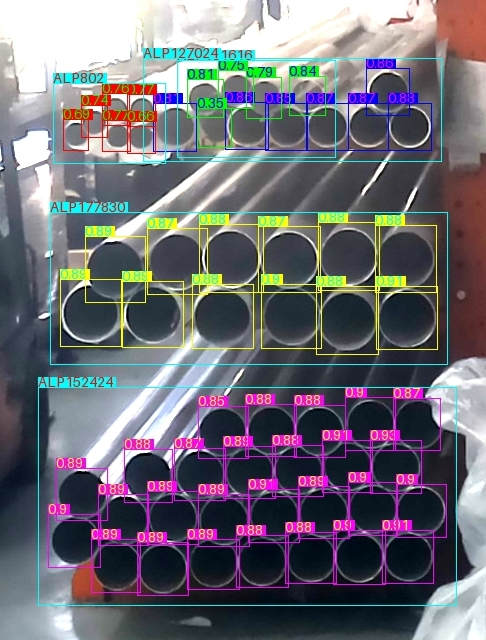

# Pipesight

Pipesight is a Python script that uses an ONNX model to detect pipes in images, analyze their sizes, and generate inventory reports. It can also send email notifications with the report and a preview image.



## Setup

1.  **Nix Environment:** This project uses Nix for dependency management. If you don't have Nix installed, follow the instructions on the [NixOS website](https://nixos.org/download/).
    Navigate to the project directory and run the following command to enter the development shell and install dependencies:
    ```bash
    nix develop
    ```

2.  **.env File:** Create a file named `.env` in the project root directory with your email credentials. This file is ignored by Git to protect your sensitive information.
    ```
    SENDER_EMAIL=your_sender_email@gmail.com
    RECIPIENT_EMAIL=your_recipient_email@example.com
    EMAIL_PASSWORD=your_email_password
    ```
    Replace the placeholder values with your actual sender email address, recipient email address, and email password.

## Usage

The `pipesight.py` script can be run from the command line with various arguments:

```bash
python3 pipesight.py [OPTIONS]
```

**Options:**

*   `-i, --imgs <image_paths>`: Process one or more image files. Provide the paths to the image files separated by spaces.
*   `-s, --serve`: Run the script as a Flask web server to handle image uploads via HTTP POST requests.
*   `-w, --write`: (Used with `--serve`) Save the processed image results to the `output` directory.
*   `-v, --verbose`: Enable verbose output, including drawing labels on detected pipes and printing size groups.
*   `-r, --save_raw`: Draw bounding boxes around all detected pipes after NMS, regardless of size. These will be drawn in green with a thinner line.
*   `-p, --profile`: Profile the inference and NMS times.
*   `-m, --mail`: Send an email with the inventory report and a preview image.
*   `-d, --device <device>`: Specify the device to use for inference (e.g., `cuda:0` or `cpu`). Default is `cuda:0`.
*   `-c, --conf <confidence_threshold>`: Set the confidence threshold for object detection. Default is `0.5`.
*   `-u, --iou <iou_threshold>`: Set the IoU threshold for Non-Maximum Suppression (NMS). Default is `0.5`.
*   `--test`: Run tests on images in the `test/images` directory and compare results with `test/results`.

**Examples:**

Process an image and save the raw detections:
```bash
python3 pipesight.py -i test/images/test1.jpg --save_raw
```

Process multiple images and send an email report:
```bash
python3 pipesight.py -i image1.jpg image2.png -m
```

Run the script as a server:
```bash
python3 pipesight.py --serve
```

## Project Structure

*   `pipesight.py`: The main script containing the pipe detection and reporting logic.
*   `pymail.py`: Contains the function for sending email notifications.
*   `flake.nix`: Nix flake file for dependency management.
*   `.env`: Environment file for storing sensitive credentials (ignored by Git).
*   `.gitignore`: Specifies intentionally untracked files that Git should ignore.
*   `models/`: Directory containing the ONNX model file (`last.onnx`).
*   `output/`: Directory where processed images and results are saved (created if it doesn't exist).
*   `test/`: Directory containing test images and expected results.
*   `uploads/`: Directory for uploaded images when running in server mode (created if it doesn't exist).
*   `sizes.txt`: File containing pipe size information.
*   `start.sh`: A shell script (purpose not detailed in the provided code).
